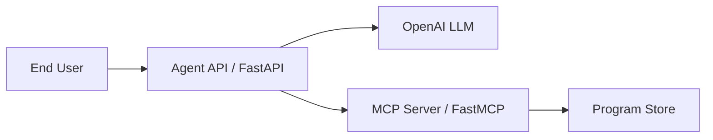

# Coca-Cola Program Activation Chatbot

An agentic chatbot solution that helps end users activate Coca-Cola programs by entering a program ID. The solution consists of two Python services designed for Google Cloud Run:

1. **MCP Server** (`mcp-server/`) — FastMCP server exposing an `activate_program` tool
2. **Agent API** (`agent-api/`) — FastAPI service with a LangChain agent powered by OpenAI that calls the MCP tool

## Architecture



## Demo program IDs

| Program ID | Benefit | Notes |
|------------|---------|-------|
| `COKE-SUMMER-2026` | 20% off participating products | Valid until Dec 31, 2026 |
| `COKE-WELCOME-PROGRAM` | $1.00 reward on next purchase | Valid until Sep 30, 2026 |
| `COKE-LEGACY-2025` | Free 20oz drink with purchase | Expired (for testing error handling) |

## Prerequisites

- Python 3.11+
- An [OpenAI API key](https://platform.openai.com/api-keys)
- Docker and Docker Compose (optional, for local container testing)
- Google Cloud SDK (`gcloud`) for Cloud Run deployment

## Local development

### 1. Start the MCP server

```bash
cd mcp-server
pip install -r requirements.txt
python server.py
```

The MCP server listens on `http://localhost:8080/mcp` using streamable HTTP transport.

### 2. Start the agent API

In a second terminal:

```bash
cd agent-api
cp .env.example .env
# Edit .env and set OPENAI_API_KEY
pip install -r requirements.txt
python main.py
```

The API listens on `http://localhost:8081` by default (or the `PORT` in `.env`).

### 3. Chat with the bot

```bash
curl -X POST http://localhost:8081/api/chat \
  -H "Content-Type: application/json" \
  -d "{\"message\": \"Please activate program COKE-SUMMER-2026\"}"
```

Health check:

```bash
curl http://localhost:8081/health
```

### Docker Compose

```bash
export OPENAI_API_KEY=your-key
docker compose up --build
```

- MCP server: `http://localhost:8080/mcp`
- Agent API: `http://localhost:8081/api/chat`

## Cloud Run deployment

### Recommended: Terraform

Use the Terraform configuration in `terraform/` to deploy both services with IAM-based service-to-service access:

```powershell
cd terraform
copy terraform.tfvars.example terraform.tfvars
# Edit terraform.tfvars with project_id and openai_api_key
terraform init
terraform apply
```

See `terraform/README.md` for full details. Terraform will:

- Build and push both container images to Artifact Registry
- Deploy the MCP server (IAM-protected; only the agent can invoke it)
- Deploy the agent API with `MCP_SERVER_URL` and Cloud Run identity token auth
- Store the OpenAI API key in Secret Manager

### Manual gcloud deployment

Both services use **streamable HTTP** MCP transport, which Cloud Run supports natively.

### Deploy MCP server

```bash
gcloud run deploy coupon-mcp-server \
  --source ./mcp-server \
  --region us-central1 \
  --allow-unauthenticated \
  --set-env-vars "MCP_TRANSPORT=streamable-http"
```

Note the service URL (for example `https://coupon-mcp-server-xxxxx-uc.a.run.app`).

### Create OpenAI API key secret

```bash
echo -n "YOUR_OPENAI_API_KEY" | gcloud secrets create openai-api-key --data-file=-
```

Grant the Cloud Run service account access to the secret if needed.

### Deploy agent API

```bash
gcloud run deploy coupon-agent-api \
  --source ./agent-api \
  --region us-central1 \
  --allow-unauthenticated \
  --set-env-vars "MCP_SERVER_URL=https://coupon-mcp-server-xxxxx-uc.a.run.app,OPENAI_MODEL=gpt-4o-mini,MCP_SERVER_NAME=program" \
  --set-secrets "OPENAI_API_KEY=openai-api-key:latest"
```

Or use the helper script:

```bash
PROJECT_ID=your-gcp-project ./deploy/deploy-cloud-run.sh
```

### Test on Cloud Run

```bash
curl -X POST "https://coupon-agent-api-xxxxx-uc.a.run.app/api/chat" \
  -H "Content-Type: application/json" \
  -d "{\"message\": \"Activate COKE-WELCOME-PROGRAM\"}"
```

## API reference

### `POST /api/chat`

Request:

```json
{
  "message": "I want to activate program COKE-SUMMER-2026"
}
```

Response:

```json
{
  "response": "Your program COKE-SUMMER-2026 has been activated successfully..."
}
```

### `GET /health`

Returns `{"status": "ok"}`.

## MCP tool: `activate_program`

The MCP server exposes one tool:

- **Name:** `activate_program`
- **Input:** `program_id` (string)
- **Output:** JSON with `success`, `program_id`, `message`, `status`, `benefit`, `description`, and `activated_at`

## Configuration

### Agent API environment variables

| Variable | Description | Default |
|----------|-------------|---------|
| `OPENAI_API_KEY` | OpenAI API key | Required |
| `OPENAI_MODEL` | OpenAI model name | `gpt-4o-mini` |
| `MCP_SERVER_URL` | Base URL of the MCP server | `http://localhost:8080` |
| `MCP_SERVER_NAME` | MCP client server alias | `program` |
| `MCP_USE_CLOUD_RUN_AUTH` | Use Cloud Run identity tokens for MCP calls | `false` |
| `PORT` | HTTP port | `8080` |
| `LOG_LEVEL` | Logging level | `INFO` |

### MCP server environment variables

| Variable | Description | Default |
|----------|-------------|---------|
| `MCP_TRANSPORT` | `streamable-http` or `stdio` | `streamable-http` |
| `PORT` | HTTP port for Cloud Run | `8080` |

## Project structure

```
.
├── agent-api/
│   ├── agent.py          # LangChain agent + MCP client
│   ├── config.py         # Settings
│   ├── main.py           # FastAPI app
│   ├── Dockerfile
│   └── requirements.txt
├── mcp-server/
│   ├── server.py         # FastMCP server
│   ├── program_service.py # Program activation logic
│   ├── Dockerfile
│   └── requirements.txt
├── terraform/
│   ├── cloud_run_agent.tf
│   ├── cloud_run_mcp.tf
│   ├── builds.tf
│   └── README.md
└── docker-compose.yml
```

## Next steps

- Replace the in-memory program store with your real Coca-Cola program backend API
- Add authentication (Cloud Run IAM, API keys, or OAuth) for production
- Add conversation memory/session support for multi-turn chats
- Wire LangSmith tracing for observability
