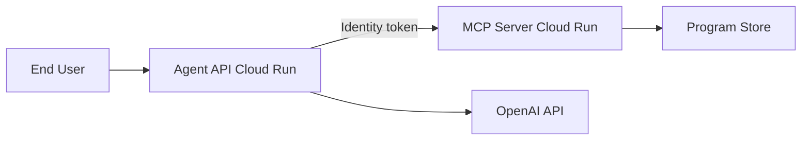

# Terraform deployment for Cloud Run

This directory deploys both services to Google Cloud Run:

- `coupon-mcp-server` — FastMCP program activation server (IAM-protected)
- `coupon-agent-api` — LangChain agent API (public by default)

The agent service receives the MCP service URL automatically and uses a Cloud Run identity token to call the MCP server. Only the agent service account is granted `roles/run.invoker` on the MCP service.

## Architecture



## Prerequisites

1. [Google Cloud SDK](https://cloud.google.com/sdk/docs/install) (`gcloud`)
2. [Terraform](https://developer.hashicorp.com/terraform/install) >= 1.5
3. A GCP project with billing enabled
4. Permission to enable APIs, create Cloud Run services, Artifact Registry, Secret Manager, and submit Cloud Build jobs

Authenticate:

```powershell
gcloud auth login
gcloud auth application-default login
gcloud config set project YOUR_PROJECT_ID
```

## Configure variables

```powershell
cd terraform
copy terraform.tfvars.example terraform.tfvars
```

Edit `terraform.tfvars` and set:

- `project_id`
- `openai_api_key`

## Deploy

```powershell
cd terraform
terraform init
terraform plan
terraform apply
```

Terraform will:

1. Enable required Google APIs
2. Create an Artifact Registry repository
3. Store the OpenAI API key in Secret Manager
4. Build and push both container images with Cloud Build
5. Deploy the MCP server to Cloud Run
6. Grant the agent service account permission to invoke the MCP server
7. Deploy the agent API with:
   - `MCP_SERVER_URL` set to the MCP service URL
   - `MCP_USE_CLOUD_RUN_AUTH=true`
   - `OPENAI_API_KEY` mounted from Secret Manager

## Outputs

After `terraform apply`:

```powershell
terraform output agent_chat_endpoint
terraform output mcp_server_url
```

Test the deployed agent:

```powershell
curl.exe -X POST "$(terraform output -raw agent_chat_endpoint)" `
  -H "Content-Type: application/json" `
  -d "{\"message\": \"Please activate program COKE-WELCOME-PROGRAM\"}"
```

## Security model

| Service | Public access | Notes |
|---------|---------------|-------|
| MCP server | No | Only the agent service account has `roles/run.invoker` |
| Agent API | Yes (default) | Set `agent_allow_unauthenticated = false` to require auth |

## Updating services

After code changes:

```powershell
terraform apply
```

Image rebuilds happen automatically when source files change because the build `null_resource` tracks file hashes.

## Destroy

Cloud Run services are created with `deletion_protection = false` so they can be removed with Terraform.

```powershell
terraform destroy
```

If you see `cannot destroy service without setting deletion_protection=false`, run apply first to update that setting, then destroy:

```powershell
terraform apply -auto-approve
terraform destroy
```

## Troubleshooting

### Cloud Build permission errors

Ensure your user can run Cloud Build and that the Cloud Build service account can write to Artifact Registry. Terraform grants:

- `roles/artifactregistry.writer`
- `roles/run.admin`
- `roles/iam.serviceAccountUser`

to the Cloud Build service account.

### Agent cannot reach MCP server

Verify:

1. `terraform output mcp_server_url`
2. Agent service account has invoker access on MCP
3. Agent logs show `Using Cloud Run identity token auth for MCP requests`

### OpenAI errors

Check Secret Manager secret `openai-api-key` and confirm billing/quota on the OpenAI account.
